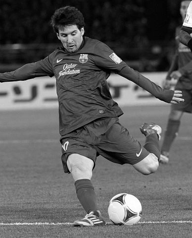
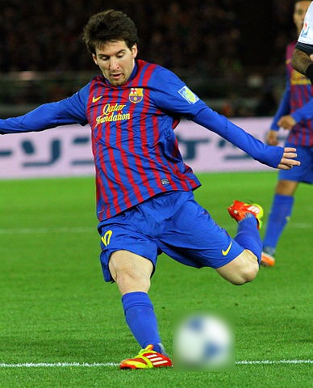
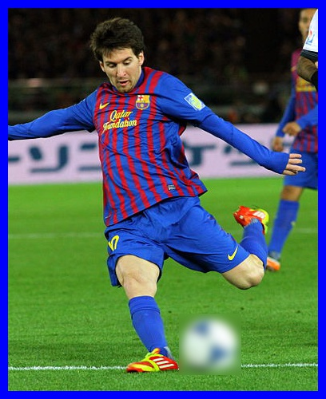

# gocv basics

This directory contains source files which demonstrate basic usage of [gocv](https://gocv.io/) `Go` package.

# Read image

We will demonstrate basic read/write operarions using an image of my favorite football player: [Lionel Messi](https://en.wikipedia.org/wiki/Lionel_Messi):


Read color image:

```go
imgPath := filepath.Join("messi.jpg")
// read in a color image
img := gocv.IMRead(imgPath, gocv.IMReadColor)
if img.Empty() {
	fmt.Printf("Failed to read image %s\n", imgPath)
	os.Exit(1)
}
```

(Image) Format of the file is determined by its content (first few bytes). `gocv` by default reads in image in *BGR* color scheme, not `RGB`. Why? Because of historical [OpenCV](https://docs.opencv.org/trunk/index.html) [reasons](https://stackoverflow.com/questions/14556545/why-opencv-using-bgr-colour-space-instead-of-rgb). So, don't forget to convert the image into a color scheme you are interested in working with!

Notice that `gocv.IMRead` function accepts `gocv.IMReadFlag` as the second argument. There is a wide range of `gocv.IMReadFlag`s which can simplify reading different types of images. The above code shows how to read a colored image. `gocv.IMReadColor` flag will skip reading in alpha channel; you need to pass in `gocv.IMReadUnchanged` flag to read in all image channels.

If you want to read a grayscale image or a colored image as grayscale, simply pass in `gocv.IMReadGrayScale` flag.Here is a grayscale image of Messi:



# Write image

Write image to filesystem:

```go
// write an image into filesystem
outPath := filepath.Join("new_messi.jpg")
if ok := gocv.IMWrite(outPath, img); !ok {
	fmt.Printf("Failed to write image: %s\n")
	os.Exit(1)
}
```

Format of the written file is determined by its extension. Note there is also `gocv.IMWriteWithParams` function which allows you to pass various image write [parameters](https://docs.opencv.org/master/d4/da8/group__imgcodecs.html#ga292d81be8d76901bff7988d18d2b42ac).

# Image matrix

`gocv.IMRead` returns an image as `gocv.Mat` obkect which is basically a multidimensional array which stores values of pixels of the read in image. `gocv.Mat` type provides a lot of useful functions for getting the information about the read in image and its manipulation.

## Image size

You can find out image size by using `Rows()` and `Cols()` functions:

```go
fmt.Printf("%s size: %d x %d\n", imgPath, img.Rows(), img.Cols())
```

Output:
```
messi.jpg size: 480 x 388
```

## Image channels

Every digital image has certain number of image channels. Colored images have R, G, B and alpha channel. You can obtain number of image channels using `Channels()` function.

Color image:
```go
fmt.Printf("%s channels: %d\n", imgPath, img.Channels())
```

Output:
```
messi.jpg channels: 3
```

Grayscale image:
```
messi.jpg channels: 1
```

`gocv` provides a `Split()` function which allows you to extract particular image channel layer and work with it separately:

```go
fmt.Printf("Number of channels: %d\n", len(gocv.Split(img)))
```

Output:
```
Number of channels: 3
```

You can merge the channels in any chosen order back together using `gocv.Merge` function. The following code converts `BGR` image to `RGB` one:

```
bgr = gocv.Split(img)
gocv.Merge(bgr[2], bgr[1], bgr[0], img)
```

## Image type

Every image read using OpenCV has a certain *image type*. Image type is not the same thing as Image Format (JPEG, PNG etc.). The type of the image is more related to things like color scheme etc. It's important to know the type of an image when accessing and manipulating image pixels.

Finding out the image type is simple:
```go
fmt.Printf("Image type: %d\n", img.Type())
```

Output
```
Image type: 16
```

This is a simple integer number, which inconveniently does not have a nice string printing function, however it's not that that hard to figure our the type of an image.

In the case of our color image, the image type would be `gocv.MatTypeCV8UC3` which basically means we have an unsigned integer 3 channels image. You can read more about it [here](https://stackoverflow.com/a/27184054/569763).

If we tried to find out the type of our grayscale image we would find out the type to be `gocv.MatTypeCV8UC1` i.e. an unsigned integer 1 channel image.

### Image pixels

`gocv`, just like OpenCV, provides a dedicated type to store pixel intensity values: `gocv.Scalar`, however it falls short in providing a conveniet function to return the pixel intensity values for particular color channels. When using `python` binding you can conveniently request pixel values by simply indexing an image i.e. `img[100,100]`. Getting pixel intensity values for each channel using `gocv` requires a bit more work:

```go
// split image channels
bgr := gocv.Split(img)
// pixel values for each channel - we know this is a BGR image
fmt.Printf("Pixel B: %d\n", bgr[0].GetUCharAt(100, 100))
fmt.Printf("Pixel G: %d\n", bgr[1].GetUCharAt(100, 100))
fmt.Printf("Pixel R: %d\n", bgr[2].GetUCharAt(100, 100))
```

Output:
```
Pixel B: 37
Pixel G: 44
Pixel R: 41
```

Notice a few things:
* We know that the image we have read has three channels, ordered as BGR
* We also know, that the image type is `gocv.MatTypeCV8UC3`

This basically means we can access particular pixel intensity value using `GetUCharAt` function of type `gocv.Mat`. Equally, we can modify particular pixel intensity values by `gocv.SetUCharAt` function.

If we simply try to use `img.GetUCharAt(100, 100)` i.e. if we didn't separate the color channels, `gocv` would return only the last channel's value: in this case that would be R channel.

### Image region

Often you want to select a small region in the image and do something with it eg. when you detect an object you might want to blur it or apply some transformation on it or whatnot. `gocv` provides a conveniently named `gocv.Mat`type  function talled `Region`. You can select a rectangle region using the standard library `image.Rectangle`.

Let's demonstrate this on a simple example using our color image. We will select a region of the image that contains football and we will blur it. The code is simple:

```go
// rectangle region
rec := image.Rectangle{Min: image.Point{214, 383}, Max: image.Point{292, 460}}
ball := img.Region(rec)
gocv.GaussianBlur(ball, ball, image.Pt(35, 35), 0, 0, gocv.BorderDefault)
```

Note that the `image.Rectangle` values were figured out manually. I use my favorite macOS tool for this: pixelmator. Once you have the coordinate, you select the football region and then apply `gocv.GaussianBlur` on it. That will give you the following result:



Notice that the selected region points to a region of the original image so any modifications you made to it will be applied to the original imaga, too.

# Image border

Finally, to conclude this chapter you can draw a border around the image using `gocv.CopyMakeBorder` function. There are several types of borders you can choose. We will demonstrate the functionality by using `gocv.BorderConstant` border type i.e. basic line border:

```go
blue := color.RGBA{B: 255}
gocv.CopyMakeBorder(img, img, 10, 10, 10, 10, int(gocv.BorderConstant), blue)
```

The resulting image looks like this:


