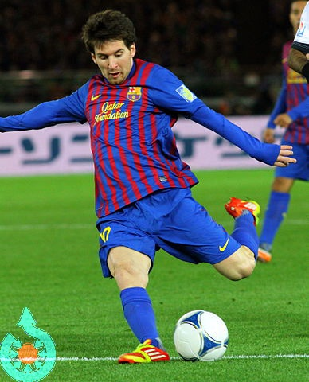
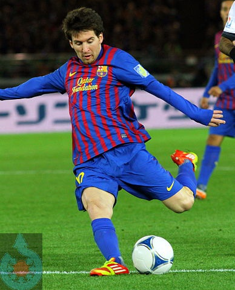
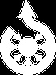
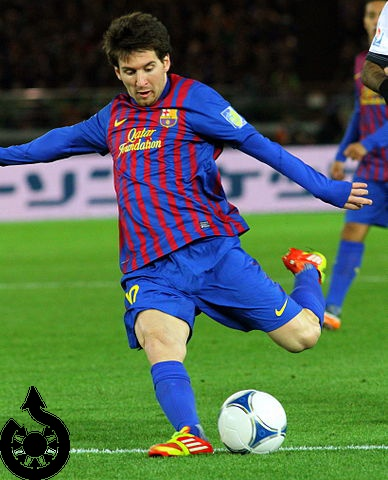
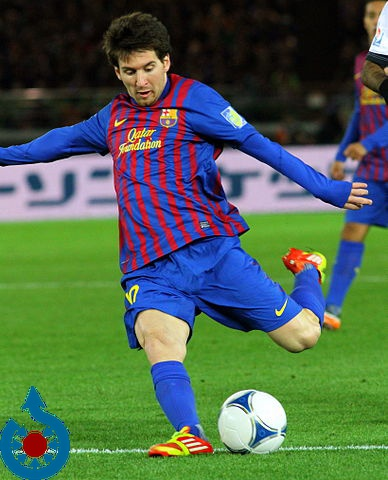

# Image arithmetics

This chapter covers the topic of digital image airthmetics. It might sound strange to think you can do arithmetics with digital images, but image arithmetics is one of the most fundamental topics of digital image processing. In this chapter we will look at image addition, subtraction and bitwise operations. We will demonstrate all concepts on practical examples.

## Addition and subtraction

In the context of digital image processing, *addition* means that corresponding pixel intensity values of each image in the sum are added together per each channel. This requires that the following conditions must be be met before adding the images together:
* images must have the same size (rows x columns)
* images must have the same number of channels

`gocv` provides a conveniently named `gocv.Add()` function which calculates the image addition. We will demonstrate its functionality on the familiar picture of Lionel Messi. We will add the familiar image of Messi to the logo of [Wikimedia Commons](https://commons.wikimedia.org/wiki/Main_Page) displayed below:


As you may have figured, the image of Messi and wiki commons logo are not of the same size and therefore the first of the conditions we listed earlier can't be fulfilled and therefore we can't simply call `gocv.Add()` passing in both images as parameters.

We could resize either of the images to the same size and then add them together, but what we will do instead is adding the Wikimedia logo to the bottom left region (of the same size as the logo) of Messi image.

The code to do this is surprisingly pretty simple. First we read in both images, then we select the bottom left region of interest (`roi`) the image of Messi and finally we add the two images together:

```go
package main

import (
        "fmt"
        "image"
        "os"
        "path/filepath"

        "gocv.io/x/gocv"
)

func main() {
        messiPath := filepath.Join("messi.jpg")
        logoPath := filepath.Join("commons.png")
        // read images
        messi := gocv.IMRead(messiPath, gocv.IMReadColor)
        if messi.Empty() {
                fmt.Printf("Failed to read image: %s\n", messiPath)
                os.Exit(1)
        }
        logo := gocv.IMRead(logoPath, gocv.IMReadColor)
        if logo.Empty() {
                fmt.Printf("Failed to read image: %s\n", messiPath)
                os.Exit(1)
        }
        // get image sizes
        messiRows, messiCols := messi.Rows(), messi.Cols()
        logoRows, logoCols := logo.Rows(), logo.Cols()
        // select bottom left region in messi picture
        minX, minY := 0, messiRows-logoRows
        maxX, maxY := logoCols, messiRows
        // select a region of interest
        rec := image.Rectangle{Min: image.Point{minX, minY}, Max: image.Point{maxX, maxY}}
        rio := messi.Region(rec)
        // add two images
        gocv.Add(rio, logo, rio)
        // write resulting image to filesystem
        outPath := filepath.Join("add_logo_messi.jpeg")
        if ok := gocv.IMWrite(outPath, messi); !ok {
                fmt.Printf("Failed to write image: %s\n")
                os.Exit(1)
        }
}
```

As you can see in the resulting image below, the left bottom part of the original image now contains the Wikimedia logo, alas the resulting colors look a bit weird: notice how orange-ish the centre of the logo is; similarly, the blue parts of logo turned green-ish. The pixel values of the logo are a result of pixel intensity addition between the logo pixels and selected region of Messi image described earlier:



## Blending

Image blending is an addition technique where the two images have different weight coefficients in the summation. This functionality is provided by `gocv.AddWeighted()` function. By calling this function you are essentially creating a linear combination of images. You can choose a "strength" (weight) of particular image being represented in the final image. Let's demonstrate this on a simple example. We will add the Messi and logo images together, but we will add more weight to the Messi image and less weight to the image of logo:

```go
package main

import (
        "fmt"
        "image"
        "os"
        "path/filepath"

        "gocv.io/x/gocv"
)

func main() {
        messiPath := filepath.Join("messi.jpg")
        logoPath := filepath.Join("commons.png")
        // read images
        messi := gocv.IMRead(messiPath, gocv.IMReadColor)
        if messi.Empty() {
                fmt.Printf("Failed to read image: %s\n", messiPath)
                os.Exit(1)
        }
        logo := gocv.IMRead(logoPath, gocv.IMReadColor)
        if logo.Empty() {
                fmt.Printf("Failed to read image: %s\n", messiPath)
                os.Exit(1)
        }
        // get image sizes
        messiRows, messiCols := messi.Rows(), messi.Cols()
        logoRows, logoCols := logo.Rows(), logo.Cols()
        // select bottom left region in messi picture
        minX, minY := 0, messiRows-logoRows
        maxX, maxY := logoCols, messiRows
        // select a region of interest
        rec := image.Rectangle{Min: image.Point{minX, minY}, Max: image.Point{maxX, maxY}}
        rio := messi.Region(rec)
        // add two images
        gocv.AddWeighted(rio, 0.6, logo, 0.4, 0.0, rio)
        // write resulting image to filesystem
        outPath := filepath.Join("add_weighted_logo_messi.jpeg")
        if ok := gocv.IMWrite(outPath, messi); !ok {
                fmt.Printf("Failed to write image: %s\n")
                os.Exit(1)
        }
}
```

The resulting image shown below demonstrates that the image of the logo is a bit "subdued" due to our assigning it a lower coefficient (`0.4`) than the coefficient we have assigned to the Messi image (`0.6`). If both coefficients were set to `1.0` we would get the same result as when using the earlier mentioned `gocv.Add()`:



## Masking

Image masking is a very powerful technique in digital image processing. It allows for fast image processing when working with non-rectangular image regions of interest such as image overlaying, replacing different kinds of objects in the image etc. In order to perform these functions we often require a "binary thresholded" image and then apply one of the `bitwise` pixel operations such as AND, OR, NOT or XOR.

### Thresholding

The concept of image thresholding is pretty simple: you define a threshold for a pixel intensity and if a pixel in the source image is higher than the threshold it is assigned some value, else it's assigned a different value. What those values are depends on the type of thresholding you decide to use.

Let's demonstrate this on a simple example. We will use the simplest thresholding technique called *binary* thresholding on the image of Wikimedia logo. First we need to turn the image into a grayscale image, then we can perform binary thresholding:

```go
package main

import (
        "fmt"
        "image"
        "os"
        "path/filepath"

        "gocv.io/x/gocv"
)

func main() {
        messiPath := filepath.Join("messi.jpg")
        logoPath := filepath.Join("commons.png")
        // read images
        logo := gocv.IMRead(logoPath, gocv.IMReadColor)
        if logo.Empty() {
                fmt.Printf("Failed to read image: %s\n", messiPath)
                os.Exit(1)
        }
        // convert to grayscale - we could also read it with gocv.IMReadGrayScale
        gocv.CvtColor(logo, logo, gocv.ColorBGRToGray)
        // create binary image
        gocv.Threshold(logo, &logo, 10.0, 255.0, gocv.ThresholdBinary)
        // write image to filesystem
        outPath := filepath.Join("wiki_commons_binary.jpeg")
        if ok := gocv.IMWrite(outPath, messi); !ok {
                fmt.Printf("Failed to write image: %s\n")
                os.Exit(1)
        }
}
```

What the above code does is, it checks all the pixel values in logo image and sets the ones which are higher than `10` to `255` (white) and the lower ones to `0` (black). The resulting binary thresholded image of logo looks like this:



### Bitwise operations

Imagine you wanted to overlay something on top of some non-rectangular part of an image region, such as placing the Wikimedia commons logo on the image of Messi. The logo has some weird shapes in it which are definitely not rectangular, so an easy rectangular region technique we saw in the previous chapter won't do the trick.

What we need to do instead is to black-out a region of interest (`roi`) in the image in the areas where the logo would fit in.
This sounds kinda hard, but you will notice that it's actually pretty easy to do using our existing knowledge. Let's demonstrate this on a practical example.

We will combine the knowledge of image thresholding and masking we talked about earlier. First we will create an **image mask**. Image mask is basically a `gocv.Mat` that only contains "binary" values: `0` (black) and some non-zero value (could be white, but not necessarily, depending on the thresholding options). Once we have the mask, we will create an *inverse* mask of it. This will flip the original mask pixel values by applying logical NOT on it i.e. the weird logo regions will have pixel values set to `0` (black). This might seem counter-intuitive but it will make sense later on, so take a leap of faith with me.

Unfortunately `gocv` doesn't seem to have any convenient function that would let us apply a mask on colored images in one function call, so what we need to do is a bit more elaborate:

```go
package main
import (
        "fmt"
        "image"
        "os"
        "path/filepath"

        "gocv.io/x/gocv"
)

func main() {
        messiPath := filepath.Join("messi.jpg")
        logoPath := filepath.Join("commons.png")
        // read images
        messi := gocv.IMRead(messiPath, gocv.IMReadColor)
        if messi.Empty() {
                fmt.Printf("Failed to read image: %s\n", messiPath)
                os.Exit(1)
        }
        logo := gocv.IMRead(logoPath, gocv.IMReadColor)
        if logo.Empty() {
                fmt.Printf("Failed to read image: %s\n", messiPath)
                os.Exit(1)
        }
        // get image dimensions
        messiRows, messiCols := messi.Rows(), messi.Cols()
        logoRows, logoCols := logo.Rows(), logo.Cols()
        // select bottom left region in messi picture
        minX, minY := 0, messiRows-logoRows
        maxX, maxY := logoCols, messiRows
        rec := image.Rectangle{Min: image.Point{minX, minY}, Max: image.Point{maxX, maxY}}
        roi := messi.Region(rec)
        // turn color image into grayscale
        grayLogo := gocv.NewMat()
        gocv.CvtColor(logo, &grayLogo, gocv.ColorBGRToGray)
        // create a binary mask
        mask := gocv.NewMat()
        gocv.Threshold(grayLogo, &mask, 10.0, 255.0, gocv.ThresholdBinary)
        // create an inverse mask
        maskInv := gocv.NewMat()
        gocv.BitwiseNot(mask, &maskInv)
        // black-out the area of logo in roi i.e. in bottom left region
        roiMask := gocv.NewMat()
        gocv.Merge([]gocv.Mat{maskInv, maskInv, maskInv}, &roiMask)
        gocv.BitwiseAnd(roi, roiMask, &roi)
        //outPath := filepath.Join("wiki_commons_blackout_messi.jpeg")
        outPath := filepath.Join("wiki_commons_blackout_messi.jpeg")
        if ok := gocv.IMWrite(outPath, messi); !ok {
                fmt.Printf("Failed to write image: %s\n")
                os.Exit(1)
        }
}
```
What this code does is it creates an image mask by binary thresholding the image of logo. It then creates the *inverse* mask from it using `gocv.BitwiseNot()` function. It then applies the inverse mask on the selected region of interest in the Messi image by using `gocv.BitwiseAnd()` function.

Notice that we had to create a new `gocv.Mat` by assembling the inverse mask into three channels `gocv.Mat` "image". This is because we need to apply this mask on a colored image which has 3 channels. If we tried to mask 3-channels image with a single layer mask the code would panic. Assembling a multiplayer `gocv.Mat` is easy using `gocv.Merge` function.

The resulting image produced by the code can be seen below:



## Overlays

Now that we know how to apply masks and how to do basic airthmetic operations, we can put it all together and overlay the Wikimedia logo on top of the image of Messi. We know that the image we obtained earlier has its pixel intensity values set to `0` in selected region of interest.

What we need to do now is to apply the original mask we have obtained earlier on the Wikimedia logo: this will select the weird color regions in logo image. We then take the resulting, masked logo image and add it to the Messi image which has logo regions blacked out. The resulting pixels will nicely add up and we will see the Wikimedia logo overlayed on the image of Messi. You can find the full code in the `main.go` function in this directory, so I will only paste the part which is missing from the earlier code snippet:

```go
        // apply the mask on logo image
        logoMask := gocv.NewMat()
        gocv.Merge([]gocv.Mat{mask, mask, mask}, &logoMask)
        gocv.BitwiseAnd(logo, logoMask, &logo)
        // add logo to roi
        gocv.Add(roi, logo, &roi)
```

The resulting image looks like this:


