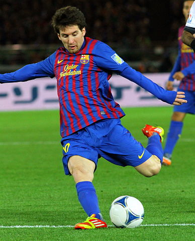
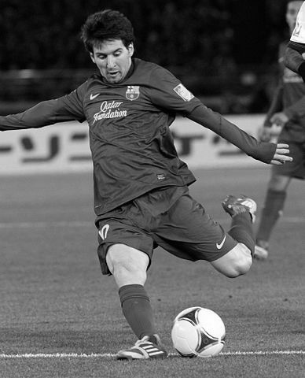
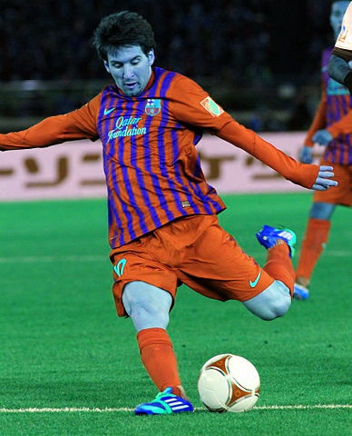
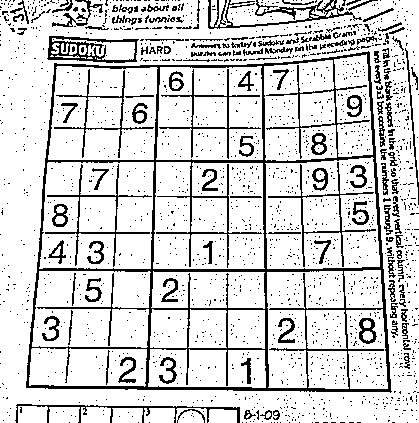
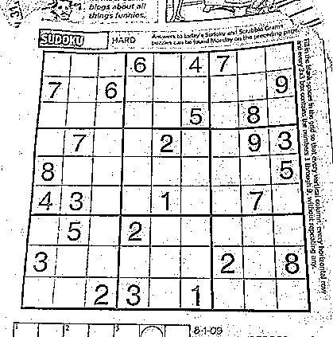
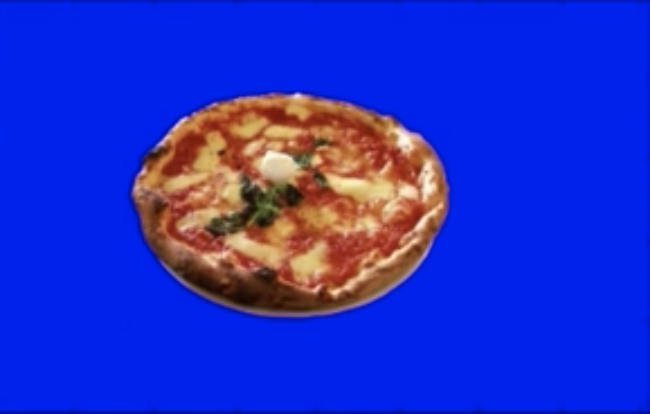
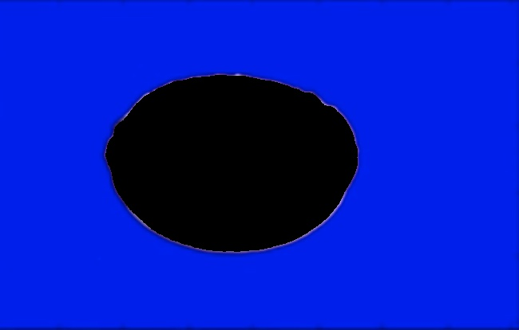
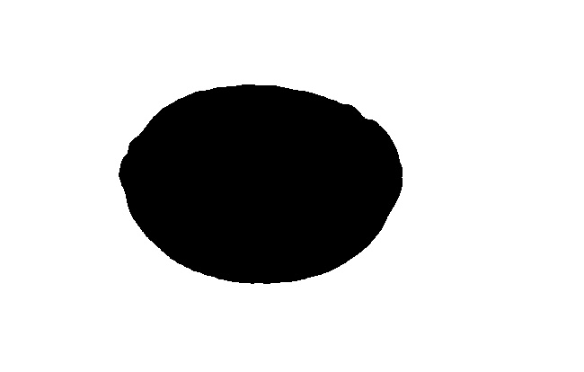

# Colorspaces and Thresholding

In the previous chapter we had a quick look at digital image airthmetics and how it can help us select various regions of the image and do something with it like overlay another image on it, blur it etc.

We have scratched upon a concept of color spaces and image thresholding, but didn't dedicate much time to it. This chapter will take a closer a look at both of these topics.

As always if you want to run/build any of the code mentioned in this `README` you must source the `env.sh` script which exports a few environment variables needed to build any code that uses `gocv`:

```
$ source env.sh
```

## Colorspaces

Digital images are usually composed of several "layers" of colors often referred to as color channels (even a grayscale image can have alpha channel, turning the number of channels of the grayscale image to `2`). To make things more complicated there are different channel "types" a.k.a. color modes (or schemes), each of which encodes color channels in different way. Each color mode has its cons and pros whicih we won't deal with here. Instead we will have a look at how to convert images between different color spaces and color modes using `gocv`.

Most developers are familiar with `RGB` color mode, which splits the image into three color channels: Red (`R`), Green (`G`) and Blue (`B`). By default `gocv` reads a colored image in `BGR` color mode. Converting between different color modes is easy using `gocv.CvtColor()` function. Equally, the same function can be used for over 100 color conversion operations. Let's have a look at simple example of convertin a colored image into a grayscale image:

```go
package main

import (
	"fmt"
	"os"
	"path/filepath"

	"gocv.io/x/gocv"
)

func main() {
	messiPath := filepath.Join("messi.jpg")
	// read images
	messi := gocv.IMRead(messiPath, gocv.IMReadColor)
	if messi.Empty() {
		fmt.Printf("Failed to read image: %s\n", messiPath)
		os.Exit(1)
	}
	// grayscale messi image
	grayMessi := gocv.NewMat()
	gocv.CvtColor(messi, &grayMessi, gocv.ColorBGRToGray)
	// write image to filesystem
	outPath := filepath.Join("gray_messi.jpeg")
	if ok := gocv.IMWrite(outPath, grayMessi); !ok {
		fmt.Printf("Failed to write image: %s\n")
		os.Exit(1)
	}
}
```

We can see the colored and grayscale image below:




For completeness, note that we could have actually read image of Messi as grayscale, not needing the conversion, that is, if we knew in advance that we would never actually need the original colored image later on like this (*note* `gocv.IMReadGrayScale` parameter passed to `gocv.IMRead` function):

```go
package main

import (
	"fmt"
	"os"
	"path/filepath"

	"gocv.io/x/gocv"
)

func main() {
	messiPath := filepath.Join("messi.jpg")
	// read images
	grayMessi := gocv.IMRead(messiPath, IMReadGrayScale)
	if messi.Empty() {
		fmt.Printf("Failed to read image: %s\n", messiPath)
		os.Exit(1)
	}
}
```

One thing which used to bite me when working with colored images was when I converted BGR image into RGB and then after having done some work with it I'd write the RGB image to the filesystem forgetting to convert it back to the original BGR color scheme which `gocv` expects. The result would look like this:




**Dont forget to convert RGB images back to BGR images before you write them to filesystem**

### HSV Colorspace

One color scheme you will encounter a lot when dealing with image processing, especially when it comes down to processing video streams, is [HSV](https://en.wikipedia.org/wiki/HSL_and_HSV): **Hue Saturation Value**. It stores color information in three channels, just like RGB, but one channel is devoted to brightness (Value), and the other two convey colour information. HSV is much better than RGB under varying light conditions and is especially useful in lossy video compression, where loss of color information is less noticeable to the human eye.

## Thresholding

As I mentioned at the beginning of this chapter we talked a bit about image thresholding in the previous chapter, in particular about a specific type of thresholding: binary image thresholding. Thresholding is usually done on grayscale image to get a bi-level (binary) image out of a grayscale image or for removing a noise, that is, filtering out pixels with too small or too large values.

There are several different types of thresholding available in `opencv`. Let's have a look at some of the options. We will use the familiar Wikimedia logo we used in the previous chapter:


In the previous chapter we have shown how a binary thresholding can help us create an image mask which can then be "applied" on another image of the same size in order to mask out some pixels. We used the `gocv.ThresholdBinary` to get a binary thresholded image. We could easily get the inverse mask by using `gocv.ThresholdBinaryInv`flag. Let's have a look how would the appropriate images of logo look like when using different thresholding types:

```go
package main

import (
	"fmt"
	"os"
	"path/filepath"

	"gocv.io/x/gocv"
)

func main() {
	// logo image
	logoPath := filepath.Join("commons.png")
	logo := gocv.IMRead(logoPath, gocv.IMReadColor)
	if logo.Empty() {
		fmt.Printf("Failed to read image: %s\n", logoPath)
		os.Exit(1)
	}
	// turn the logo to gray image
	grayLogo := gocv.NewMat()
	gocv.CvtColor(logo, &grayLogo, gocv.ColorBGRToGray)
	// binary threshold
	binLogo := gocv.NewMat()
	gocv.Threshold(grayLogo, &binLogo, 10.0, 255.0, gocv.ThresholdBinary)
	// inverse binary logo
	invBinLogo := gocv.NewMat()
	gocv.Threshold(grayLogo, &invBinLogo, 10.0, 255.0, gocv.ThresholdBinaryInv)
	// write logo to filesystem
	if ok := gocv.IMWrite("bin_logo.jpeg", binLogo); !ok {
		fmt.Printf("Failed to write image\n")
		os.Exit(1)
	}
	if ok := gocv.IMWrite("inv_bin_logo.jpeg", invBinLogo); !ok {
		fmt.Printf("Failed to write image\n")
		os.Exit(1)
	}
}
```

The resulting images illustrate both thresholding types and how truly inverse they are to one another:


### Adaptive Thresholding

So far we had a look at **fixed thresholding** techniques where we explicitly specified the threshold value. The problem with this approach is, if we don't know the right value in advance we end up testing various threshold values like there is no tomorrow. Futhermore, the value which we eventually settle on after endless tests might not work well in different lighting conditions. This is where adaptive thresholding can help us out.

Adaptive thresholding calculates different thresholds for different regions of the same image. So we end up with several threshold values which gives us better results for images with regions of varying illumination. We will demonstrate different thresholding techniques on an image of sudoku game:


We will apply both adaptive mean and adaptive gaussian thresholding on the sudoku image and compare the results:

```go
package main

import (
	"fmt"
	"os"
	"path/filepath"

	"gocv.io/x/gocv"
)

func main() {
	// sudoku image
	sudokuPath := filepath.Join("sudoku.jpg")
	sudoku := gocv.IMRead(sudokuPath, gocv.IMReadGrayScale)
	if sudoku.Empty() {
		fmt.Printf("Failed to read image: %s\n", sudokuPath)
		os.Exit(1)
	}
	// adaptive mean
	adptMean := gocv.NewMat()
	gocv.AdaptiveThreshold(sudoku, &adptMean, 255.0, gocv.AdaptiveThresholdMean, gocv.ThresholdBinary, 5, 4.0)
	// adaptive gaussian
	adptGauss := gocv.NewMat()
	gocv.AdaptiveThreshold(sudoku, &adptGauss, 255.0, gocv.AdaptiveThresholdGaussian, gocv.ThresholdBinary, 5, 4.0)
	// write images to filesystem
	outAdptMean := "sudoku_adaptive_mean.jpeg"
	if ok := gocv.IMWrite(outAdptMean, adptMean); !ok {
		fmt.Printf("Failed to write image: %s\n", outAdptMean)
		os.Exit(1)
	}
	outAdptGauss := "sudoku_adaptive_gauss.jpeg"
	if ok := gocv.IMWrite(outAdptGauss, adptGauss); !ok {
		fmt.Printf("Failed to write image: %s\n", outAdptGauss)
		os.Exit(1)
	}
}
```

As you can see on the resulting images below, Gaussian thresholding performed slightly better: the image that passed through it is less noisy than the one thresholded by adaptive mean threshold. Gaussian threshold uses gaussian blur filter which helps with removing noise before the image gets processed. This is a widely used technique in digital image processing:




### Advanced thresholding

There is one more advanced thresholding technique available in `opencv`: Otsu Binarization. It's used in combination with fixed thresholding, but provides more advanced features.

Otsu Binarization is handy when you are not sure about threshold value and your image is *bimodal* i.e. it has two histogram peaks (two "dominant" colors). In this case, finding the right threshold value can be a nightmare as you are essentially dancing between two colors. Otsu Binarization thresholding helps with this. When using Otsu on bimodal image, you normally pass threshold value as `0` and simply add the `gocv.ThresholdBinary` and `gocv.ThresholdOtsu` flags together:

```go
gocv.Threshold(img, &img, 0.0, 255.0, gocv.ThresholdBinary+gocv.ThresholdOtsu)
```

### Tracking and extraction objects, manipulting object scenes

Before we wrap up this chapter let's talk about something slightly more elaborate which is akin to how visual effects in movies are done. Usually, visual effects in movies are shot on a blue or green background which is then replaced in post production with another background. Similarly, you can also extract an object of certain color and replace it with another object or simply just follow it around i.e. track it.

You can achieve object/background extraction by using `gocv.InRange()` function which is a range thresholding function that allows you to pick lower and upper bound threshold values for pixel intensities. We will illustrate the usage of this function by cutting out pizza from the image below which has pizza sitting on a blue background:



Here is what we are going to do:
* we will search for all the blue pixels
* we will create a mask which will mask all pizza pixels with black pixels
* we will use the mask to cut out the pizza out of the image

In order to use `gocv.InRange()` function we need to pick lower and upper pixel values. We will once again use the HSV color mode. The tricky part, though, is to figure out what should the blue color upper and lower bounds be in HSV color space? In RGB colorspace this would be easy: `[255, 0, 0]` is the absolute blue color -- we would pick the range values empirically around `255`. In HSV colorspace things are not as simple. What we will do is we will find HSV values for the absolute blue color in HSV color space and then pick the lower and upper bounds like this: `[H-10, 100,100]` and `[H+10, 255, 255]`. We can get these pixel values using following program:

```go
package main

import (
	"fmt"

	"gocv.io/x/gocv"
)

func main() {
	blue := gocv.NewMatFromScalar(gocv.NewScalar(255.0, 0.0, 0.0, 0.0), gocv.MatTypeCV8UC3)
	gocv.CvtColor(blue, &blue, gocv.ColorBGRToHSV)
	hsv := gocv.Split(blue)
	fmt.Printf("H: %d S: %d V: %d\n", hsv[0].GetUCharAt(0, 0), hsv[1].GetUCharAt(0, 0), hsv[2].GetUCharAt(0, 0))
}
```

The resulting `HSV` triplette will look like this:

```console
H: 120 S: 255 V: 255
```

This means that our upper and lower bound values for blue background would be: `[110, 100, 100]` and `[130, 255, 255]`.

Let's get to coding. The code to cut out the pizza from the image shown above used to be a bit elaborate due to how `gocv` API used to work, but luckily a [PR]() opened by me some time ago got merged it so the required code is a bit simpler. Here it is in full:

```go
package main

import (
	"fmt"
	"os"
	"path/filepath"

	"gocv.io/x/gocv"
)

func main() {
	// read image
	pizzaPath := filepath.Join("pizza.png")
	pizza := gocv.IMRead(pizzaPath, gocv.IMReadColor)
	if pizza.Empty() {
		fmt.Printf("Failed to read image: %s\n", pizzaPath)
		os.Exit(1)
	}
	// Convert BGR to HSV image (dont modify the original)
	hsvPizza := gocv.NewMat()
	gocv.CvtColor(pizza, &hsvPizza, gocv.ColorBGRToHSV)
	pizzaRows, pizzaCols := hsvPizza.Rows(), hsvPizza.Cols()
	// define HSV color upper and lower bound ranges
	lowerMask := gocv.NewMatWithSizeFromScalar(gocv.NewScalar(110.0, 50.0, 50.0, 0.0), pizzaRows, pizzaCols, gocv.MatTypeCV8UC3)
	upperMask := gocv.NewMatWithSizeFromScalar(gocv.NewScalar(130.0, 255.0, 255.0, 0.0), pizzaRows, pizzaCols, gocv.MatTypeCV8UC3)
	// global mask
	mask := gocv.NewMat()
	gocv.InRange(hsvPizza, lowerMask, upperMask, &mask)
	// cut out pizza mask
	pizzaMask := gocv.NewMat()
	gocv.Merge([]gocv.Mat{mask, mask, mask}, &pizzaMask)
	// cut out the pizza and convert back to BGR
	gocv.BitwiseAnd(hsvPizza, pizzaMask, &hsvPizza)
	gocv.CvtColor(hsvPizza, &hsvPizza, gocv.ColorHSVToBGR)
	// write image to filesystem
	outPizza := "no_pizza.jpeg"
	if ok := gocv.IMWrite(outPizza, hsvPizza); !ok {
		fmt.Printf("Failed to write image: %s\n", outPizza)
		os.Exit(1)
	}
	// write pizza mask to filesystem
	outPizzaMask := "no_pizza_mask.jpeg"
	if ok := gocv.IMWrite(outPizzaMask, mask); !ok {
		fmt.Printf("Failed to write image: %s\n", outPizza)
		os.Exit(1)
	}
}
```

Note that when allocating the `gocv.Scalar`s to define some pixel values, you need to make sure these are 3 channel types as `HSV` is a 3 channel color space; you can use `gocv.MatTypeCV8UC3` type for this.

This is what the resulting image looks like once we cut out the pizza from it:



For completeness let's also display what the mask looks like once it passess through `gocv.InRange()` thresholding. Note that all the blue pixels from the original image are now white i.e. the intensity value these pixels now have is `255` and all the other pixels -- the pizza ones -- have pixel intensity set to `0`:



This wraps up this chapter on colorspaces and image thresholding.
