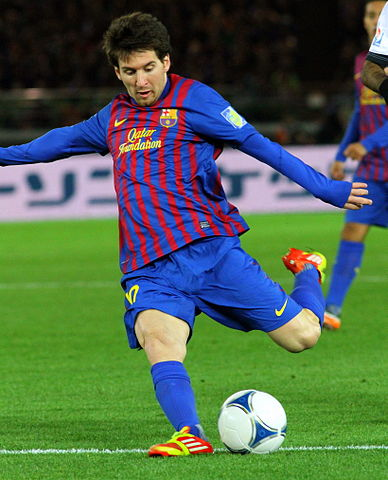
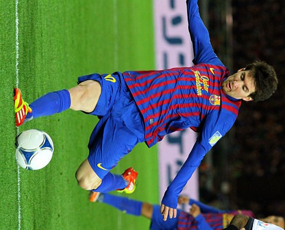
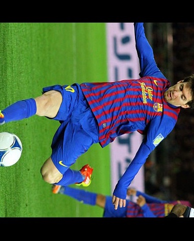
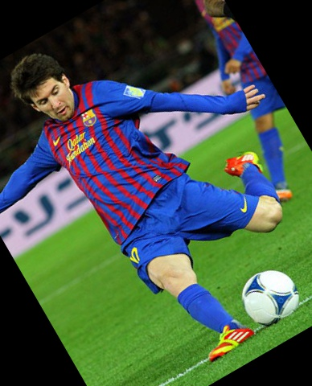
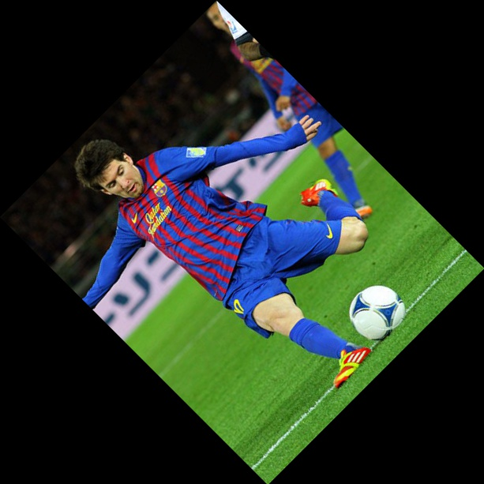
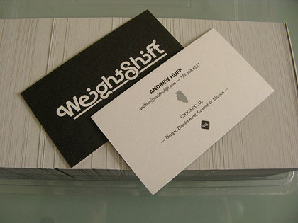

# Geometric Transformations

In the previous chapter we had a look at different kinds of image thresholding techniques and how they can be used in practice. This chapter is dedicated to geometric transformation of images, in particular to image scaling (image resizing), image translation (shifting of object locations) and image rotations.

Once again we will demonstrate the functionality on the familiar image of Messi:



## Scaling

Scaling images basically means resizing their size by either shrinking them or enlarging them. Resizing image can be done using `gocv.Resize()` function. You can either specify the image size via the `image.Point` parameter or via scale factors for both image dimensions. See the [documentation](https://godoc.org/gocv.io/x/gocv#Resize) for more detail.

As for the actual scaling algorithm, there are a few options to choose from. The official `OpenCV` documentation recommends to use `gocv.InterpolationArea` interpolation type **when shrinking** the images, whereas **when enlarging**, it's the best to use `gocv.InterpolationCubic` (apparently, a bit slow) or `gocv.InterpolationLinear` which is the default and faster, but not as good.

Following code demonstrates both shrinking and elarging of Messi image:

```go
package main

import (
	"fmt"
	"image"
	"os"
	"path/filepath"

	"gocv.io/x/gocv"
)

func main() {
	messiPath := filepath.Join("messi.jpg")
	// read image
	messi := gocv.IMRead(messiPath, gocv.IMReadColor)
	if messi.Empty() {
		fmt.Printf("Failed to read image: %s\n", messiPath)
		os.Exit(1)
	}
	// size of the original image
	rows, cols := messi.Rows(), messi.Cols()
	fmt.Printf("Rows: %d, Cols: %d\n", rows, cols)
	// shrink messi
	shrink := gocv.NewMat()
	gocv.Resize(messi, &shrink, image.Point{}, 0.5, 0.5, gocv.InterpolationArea)
	fmt.Printf("Rows: %d, Cols: %d\n", shrink.Rows(), shrink.Cols())
	// enlarge messig
	enlarge := gocv.NewMat()
	gocv.Resize(messi, &enlarge, image.Point{}, 2, 2, gocv.InterpolationCubic)
	fmt.Printf("Rows: %d, Cols: %d\n", enlarge.Rows(), enlarge.Cols())
        // write images to filesystem
	smallPath := filepath.Join("small_messi.jpeg")
	if ok := gocv.IMWrite(smallPath, shrink); !ok {
		fmt.Printf("Failed to write image: %s\n")
		os.Exit(1)
	}
	largePath := filepath.Join("large_messi.jpeg")
	if ok := gocv.IMWrite(largePath, enlarge); !ok {
		fmt.Printf("Failed to write image: %s\n")
		os.Exit(1)
	}
}
```

And here are the resulting images - note the slightly smaller resolution of the first one:


## Rotation

Image rotation is a rather complex topic which involves transforming an image using [transformation matrix](https://en.wikipedia.org/wiki/Transformation_matrix) into a new image. The transformation matrix can be crafted either manually or using `gocv` helper functions, but before we talk about the complex arbitrary image rotations in more detail let's have a look how to perform the simplest form of rotation: rotation by multple of 90 degrees clockwise or counter clockwise.

## Simple Rotation

If we want to rotate an image just by multiple of 90 degrees [counter] clockwise we can use `gocv.Rotate()` function and supply appropriate `RotateFlag` to instruct what kind of rotation we are interested in doing. See the sample code below which rotates the Messig image by 90 degrees clockwise:

```go
package main

import (
	"fmt"
	"os"
	"path/filepath"

	"gocv.io/x/gocv"
)

func main() {
	messiPath := filepath.Join("messi.jpg")
	// read image
	messi := gocv.IMRead(messiPath, gocv.IMReadColor)
	if messi.Empty() {
		fmt.Printf("Failed to read image: %s\n", messiPath)
		os.Exit(1)
	}

	rotated := gocv.NewMat()
	gocv.Rotate(messi, &rotated, gocv.Rotate90Clockwise)

	outPath := filepath.Join("rotated_messi.jpeg")
	if ok := gocv.IMWrite(outPath, rotated); !ok {
		fmt.Printf("Failed to write image: %s\n")
		os.Exit(1)
	}
}
```

Here is the resulting image:



There are a few more rotation flags available in `gocv`, so plese do check out the documentation. Let's have a look now at how we can rotate images in arbitrary angles.

## Arbitrary rotations

If you want to do more interesting rotations than just by 90 degrees you will have to perform [affine transformation](https://en.wikipedia.org/wiki/Affine_transformation) on the image using the aforementioned transformation matrix. Luckily, you don't normally have to construct the matrix manually as `gocv` provides convenient helper functions to do this.

For the purpose of roattion image transformation we can use `gocv.GetRotationMatrix2D()` function which creates and returns the transformation matrix to us. So let's have a look how we can perform the same rotation we did earlier i.e. by 90 degrees.

Once we have the rotation transformation matrix, we can use `gocv.WarpAffine()` function to do the heavy lifting for us. There is also `WarpAffineWithParams()` function which provides more parameters to control the transformation such border type around the transformed image or the interpolation type (by default it's set to `InterpolationLinear`).

A naive approach would look something like this (I will explain, later on why this approach is naive):

```go
package main

import (
	"fmt"
	"image"
	"os"
	"path/filepath"

	"gocv.io/x/gocv"
)

func main() {
	messiPath := filepath.Join("messi.jpg")
	// read image
	messi := gocv.IMRead(messiPath, gocv.IMReadColor)
	if messi.Empty() {
		fmt.Printf("Failed to read image: %s\n", messiPath)
		os.Exit(1)
	}

	cols, rows := messi.Cols(), messi.Rows()
	scale, angle := 1.0, 270.0
	center := image.Point{cols / 2, rows / 2}
	rotation := gocv.GetRotationMatrix2D(center, angle, scale)

	rotated := gocv.NewMat()
	gocv.WarpAffine(messi, &rotated, rotation, image.Point{cols, rows})

	outPath := filepath.Join("naive_rotated_messi.jpeg")
	if ok := gocv.IMWrite(outPath, rotated); !ok {
		fmt.Printf("Failed to write image: %s\n")
		os.Exit(1)
	}
}
```

Judging by the look of the image below, it should be clearer to us why I called this rotation **naive**:



Notice how the resulting image is truncated: Messi is missing a part of his head and foot! The reason for this lies in the size of the resulting image we have chosen the rotated image to be transformed into. We have naively picked the size of the transformed image to be the same as the original one and it's clearly not big enough.

Now, we could increase the size of the resulting image or we could set the scale factor to be less than `1.0`. Both of these approaches would work, but are not great: using the former we would have to empirically find the right image size to fit the rotated Messi in, using the latter the original image would be shrunk. Instead, we will do a bit of linear algebra to find out the right resulting image dimensions without sacrificing the size of the original image.

For completeness, the problem with the size of the resulting image gets similarly weird if we choose an arbitrary rotation i.e. not just by multiples of 90 degrees, such as 30 degrees:



I dont want to go into too much into the maths of how the affine transformations work, but in laymens terms, the transformation does not change the intensity of the pixels, it merely "shifts" them into a new location in the same linear space (alas, different "image" space).

The shift can be calculated by a simple matrix multiplication using the coordinates of the original pixel position on the 2D image plane and particular [transformation matrix](https://en.wikipedia.org/wiki/Affine_transformation#Image_transformation). The transformation will give us cartesian space coordinates which we can use to compute the new image size (by calculating the position of the [`width`, `height`] point). In short, we will be doing the following:
* Apply Scaling
* Apply Rotation
* Apply Trasvection (shift)

We will rotate Messi's image by 45 degrees and place it into a new image wihout truncating the original image:

```go
package main

import (
	"fmt"
	"image"
	"math"
	"os"
	"path/filepath"

	"gocv.io/x/gocv"
)

const x = math.Pi / 180

func Rad(d float64) float64 { return d * x }
func Deg(r float64) float64 { return r / x }

func main() {
	messiPath := filepath.Join("messi.jpg")
	// read image
	messi := gocv.IMRead(messiPath, gocv.IMReadColor)
	if messi.Empty() {
		fmt.Printf("Failed to read image: %s\n", messiPath)
		os.Exit(1)
	}

	cols, rows := messi.Cols(), messi.Rows()
	scale, angle := 1.0, 45.0
	radAngle := Rad(angle)
	center := image.Point{cols / 2, rows / 2}
	rotation := gocv.GetRotationMatrix2D(center, angle, scale)

	// Scale -> Rotate -> Translate
	// Scale
	scaleX, scaleY := float64(cols)*scale, float64(rows)*scale
	// Rotate
	newX := math.Abs(scaleX*math.Cos(radAngle)) + math.Abs(scaleY*math.Sin(radAngle))
	newY := math.Abs(scaleX*math.Sin(radAngle)) + math.Abs(scaleY*math.Cos(radAngle))
	// Translate
	tx := (newX - float64(cols)) / 2
	ty := (newY - float64(rows)) / 2
	rotation.SetDoubleAt(0, 2, rotation.GetDoubleAt(0, 2)+tx)
	rotation.SetDoubleAt(1, 2, rotation.GetDoubleAt(1, 2)+ty)

	rotated := gocv.NewMat()
	gocv.WarpAffine(messi, &rotated, rotation, image.Point{int(newX), int(newY)})

	outPath := filepath.Join("rotated_properly_messi.jpeg")
	if ok := gocv.IMWrite(outPath, rotated); !ok {
		fmt.Printf("Failed to write image: %s\n")
		os.Exit(1)
	}
}
```

The resulting image clearly shows that the image is properly rotated by 45 degrees without any truncation, alas, obviously the size of the new image has increased:



## Perspective transformation

Before we finish this chapter, let's briefly talk about one last case of geometric transformations: perspective transformation. Perspective transformation is a very important concept used for example in digital cameras. Just like in the case of image rotation, in order to perform perspective transformation we will need a transformation matrix. Computing this matrix can be a bit laborious, despite `gocv` providing us with a handy helper function: `gocv.GetPerspectiveTransform()`. This function accepts two slices of `image.Point`s which should contain coordinates of the points, location of which we are transforming from one plane to another. This was a bit of a mouthful, so let's illustrate this on a simple example.

A classic schoolbook example of perspective transformation is an image "alignment" when an image of some landmark has been taken by a camera from a "weird" angle. The problem now is a bit of distortion of the landmark as well as some of the landmark's features are not properly visible. By applying the perspective transformation we can correct the image and bring the landmark closer to the viewer's perspective by aligning it with the edges of the projection image plane. Let's see what we mean by that by looking at the following picture of a random [business card](https://commons.wikimedia.org/wiki/File:Free-business-cards.jpg) [1]



The image of the business card is a bit rotated and thus applying some kind of [OCR](https://en.wikipedia.org/wiki/Optical_character_recognition) can be a bit tricky -- we would like to bring the picture closer to the viewers perspective by "projecting" it to the viewer's plane so it is better visible. Obviously, the image in this example is just a simple example, but the same concept can be applied on a way more complicated pictures of lets say texts of books or whatnot.

In order to apply the perspective transformation on the image we can use the following code:

```go
import (
	"fmt"
	"image"
	"math"
	"os"
	"path/filepath"

	"gocv.io/x/gocv"
)

func main() {
	cardPath := filepath.Join("card.jpg")
	// read image
	card := gocv.IMRead(cardPath, gocv.IMReadColor)
	if card.Empty() {
		fmt.Printf("Failed to read image: %s\n", cardPath)
		os.Exit(1)
	}

        // image coordinages corners of the select business card object
	origImg := []image.Point{
		image.Point{128, 165}, // top-left
		image.Point{215, 275}, // bottom-left
		image.Point{385, 128}, // bottom-right
		image.Point{300, 40},  // top-right
	}

	// calculate height as a distance between (top-left, bottom-left) and (top-right, bottom-right)
	heightA := math.Sqrt(math.Pow(float64(origImg[0].X-origImg[1].X), 2) + math.Pow(float64(origImg[0].Y-origImg[1].Y), 2))
	heightB := math.Sqrt(math.Pow(float64(origImg[3].X-origImg[2].X), 2) + math.Pow(float64(origImg[3].Y-origImg[2].Y), 2))
	height := int(math.Max(heightA, heightB))

	// caluclate width as a distance between () and ()
	widthA := math.Sqrt(math.Pow(float64(origImg[0].X-origImg[3].X), 2) + math.Pow(float64(origImg[0].Y-origImg[3].Y), 2))
	widthB := math.Sqrt(math.Pow(float64(origImg[1].X-origImg[2].X), 2) + math.Pow(float64(origImg[1].Y-origImg[2].Y), 2))
	width := int(math.Max(widthA, widthB))

	newImg := []image.Point{
		image.Point{0, 0},
		image.Point{0, height},
		image.Point{width, height},
		image.Point{width, 0},
	}

	transform := gocv.GetPerspectiveTransform(origImg, newImg)

	perspective := gocv.NewMat()
	gocv.WarpPerspective(card, &perspective, transform, image.Point{width, height})

	outPath := filepath.Join("card_perspective.jpg")
	if ok := gocv.IMWrite(outPath, perspective); !ok {
		fmt.Printf("Failed to write image: %s\n")
		os.Exit(1)
	}
}
```

And this is the resulting image


There are some important points to note here. First, in order to find the perspective transformation matrix we need to select 4 points of interest in the original image read from local filesystem of which 3 must not be collinear. These are stored in the `origImg` slice. We need to map these points into corresponding point in the transformed image: these are stored in the `newImg` slice. Note that we figured out the size of the image based on the original coordinates, trying to "preserve" the size of the original image -- at least to some extent. The size of this image is passed in to the `gocv.WarpPerspective` function which handles the image transformation.

With this final example we will conclude this chapter on the geometric transformation of images, but please do check out other image transformations options.

[1] Free business cards, Wikimedia, [https://commons.wikimedia.org/wiki/File:Free-business-cards.jpg](https://commons.wikimedia.org/wiki/File:Free-business-cards.jpg)
